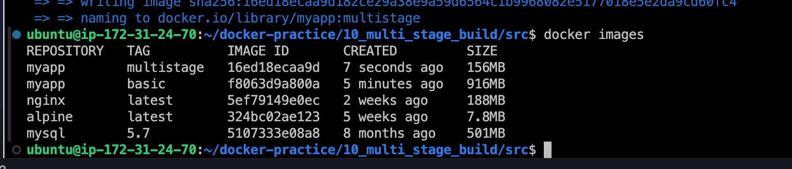

# Multi-Stage Docker Build Example

## Project Overview

This project demonstrates how to optimize Docker images using multi-stage builds. By using multi-stage builds, we can reduce the size of our Docker images, improve security by only including necessary dependencies, and streamline the process of creating production-ready images.

### Key Concepts Covered
- Dockerfile basics
- Multi-stage Docker builds
- Image optimization
- Best practices for Docker image creation

## Project Structure

```bash
10_multi_stage_build/
├── screenshots/
│   └── comparison_image_sizes.png
├── src/
│   ├── index.js
│   ├── package.json
├── Dockerfile
└── README.md
```

## Prerequisites

- Docker installed on your machine
- Basic understanding of Docker and Dockerfiles
- Node.js installed if you wish to run the application locally

## Getting Started

### Step 1: Clone the Repository

```bash
git clone https://github.com/phsinghka/docker-practice.git
cd 10_multi_stage_build
```

### Step 2: Build and Run the Basic Docker Image

0. **Dockerfile**
   ```bash
   # Step 1: Use a Node.js base image
   FROM node:14

   # Step 2: Set the working directory
   WORKDIR /app

   # Step 3: Copy the application files
   COPY package*.json ./
   RUN npm install
   COPY . .

   # Step 4: Expose the port and start the application
   EXPOSE 8080
   CMD ["npm", "start"]

   ```

1. **Build the Docker image:**

   ```bash
   docker build -t myapp:basic .
   ```

2. **Run the Docker container:**

   ```bash
   docker run -p 8080:8080 myapp:basic
   ```

3. **Access the application:**

   Open your web browser and go to `http://localhost:8080`. You should see "Hello, World!".

4. **Check the Docker image size:**

   ```bash
   docker images
   ```


### Step 3: Optimize the Docker Image with Multi-Stage Builds

0. **Multi-Stage Dockerfile**
    ```bash
    # Step 1: Build Stage
    FROM node:14 AS build

    WORKDIR /app
    COPY package*.json ./
    RUN npm install
    COPY . .

    # Step 2: Run Stage
    FROM node:alpine

    WORKDIR /app
    COPY --from=build /app /app

    EXPOSE 8080
    CMD ["npm", "start"]

    ```

1. **Modify the Dockerfile for multi-stage builds:**

   Update the Dockerfile to include multiple stages, reducing the size of the final image.

2. **Build the optimized Docker image:**

   ```bash
   docker build -t myapp:multistage .
   ```

3. **Run the optimized Docker container:**

   ```bash
   docker run -p 8080:8080 myapp:multistage
   ```

4. **Access the application:**

   Open your web browser and go to `http://localhost:8080`. The application should function the same as before.

5. **Check the optimized Docker image size:**

   ```bash
   docker images
   ```


### Step 4: Compare Image Sizes

Compare the size of the basic image with the optimized multi-stage image. Notice the reduction in size, which translates to a more efficient and secure Docker image.



### Step 5: Clean Up

1. **Remove unused Docker images:**

   ```bash
   docker image prune
   ```
